# Riverview Regional Medical Center: Federation, OAuth 2.0 & OIDC Lab

**Project Type:** Federation | SSO | API Authorization | Token Governance
**Environment:** Microsoft Entra ID | Salesforce Developer Edition | Microsoft Graph Explorer | PowerShell 7.6
**Simulated Org:** Riverview Regional Medical Center
**Protocols:** SAML 2.0 | OAuth 2.0 | OpenID Connect (OIDC)
**Framework Mapping:** NIST SP 800-53 Rev. 5

---

## Overview

This is the federation and authentication protocol capstone of the Riverview Regional Medical Center IAM program. It covers three identity integration patterns that every enterprise environment uses: SAML 2.0 for legacy application SSO, OAuth 2.0 for delegated API authorization, and OIDC for modern identity-aware authentication.

All three protocols were implemented in a live Entra ID tenant and tested end-to-end. The project includes a PowerShell automation script that programmatically replicates the full app registration workflow, and a JWT claims analysis that maps token behavior to governance controls.

**Related project:** [entra-id-iam-project](https://github.com/FabCloudTech/entra-id-iam-project) covers Days 1-6 of the Riverview IAM program: user provisioning, PIM, enterprise app assignments, access reviews, offboarding, and Zero Trust Conditional Access.

---

## Business Problem

Enterprise environments run multiple authentication protocols simultaneously. Salesforce authenticates via SAML. Internal APIs use OAuth tokens. Modern apps layer OIDC on top for user identity. An IAM team that only understands one protocol creates integration gaps, misconfigurations, and ungoverned machine credentials.

This project demonstrates the ability to implement, validate, and govern all three protocols in a single tenant and document the security and governance implications of each.

---

## Project Structure

| Part | Focus | Method |
|---|---|---|
| Part A | SAML 2.0 federation with Salesforce | Entra portal + Salesforce SSO settings |
| Part B | OAuth 2.0 / OIDC via Microsoft Graph | Entra portal + Graph Explorer |
| Part C | PowerShell app registration automation | PowerShell + Microsoft Graph SDK |
| Part D | JWT claims analysis | jwt.ms token decoder |

---

## Part A: SAML 2.0 Federation with Salesforce

Configured SAML SSO between Entra ID (Identity Provider) and Salesforce Developer Edition (Service Provider). A user authenticates against Entra ID and Salesforce accepts the signed SAML assertion without requiring a separate Salesforce password. This is the pattern used for any enterprise SaaS application that does not support modern OAuth/OIDC natively.

**What was configured:**
- Entity ID and Reply URL (ACS) populated with Salesforce-specific values in Entra
- Signing certificate downloaded from Entra and uploaded to Salesforce
- Salesforce SSO settings configured with Entra IdP metadata
- Authentication Configuration in Salesforce My Domain updated to use Entra ID SSO
- Federated login tested and confirmed working end-to-end

---

**Step 1 - Basic SAML Configuration: Entity ID and ACS URL**

Basic SAML Configuration panel showing Entity ID (`https://riverviewregional-dev-ed.develop.my.salesforce.com`) and Reply URL (ACS) pointed at the Salesforce callback endpoint. These two fields are what Salesforce requires before it will accept a SAML assertion from Entra as the IdP.

**NIST Mapping:** IA-8 (Identification and Authentication - Non-Organizational Users), AC-17 (Remote Access)

---

**Step 2 - Salesforce: SAML enabled**

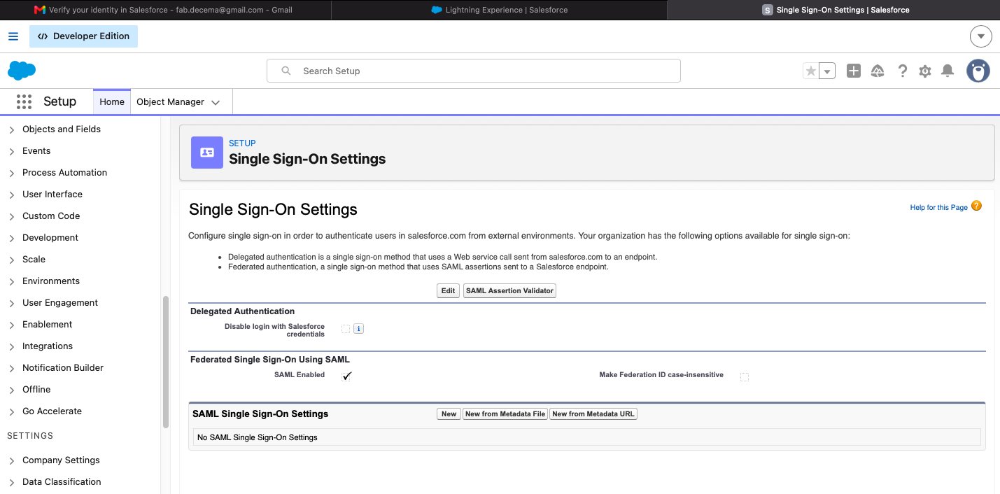

Salesforce Single Sign-On Settings page confirming Federated Single Sign-On Using SAML is enabled. SAML Enabled checkbox is checked. This activates Salesforce's ability to accept external SAML assertions from an IdP.

---

**Step 3 - Salesforce SAML SSO settings configured with Entra values**

SAML Single Sign-On Settings detail page showing all Entra ID values applied: Name: Entra_ID_SSO, SAML Version 2.0, Identity Provider Certificate uploaded (CN=Microsoft Azure Federated SSO Certificate, expiry 22 May 2029), Request Signature Method: RSA-SHA256, Identity Provider Login URL: `https://login.microsoftonline.com/4...`. Entity ID confirms the Salesforce org URL. Salesforce is now fully configured to trust assertions from Entra ID.

---

**Step 4 - My Domain authentication config: Entra ID SSO set as authentication service**

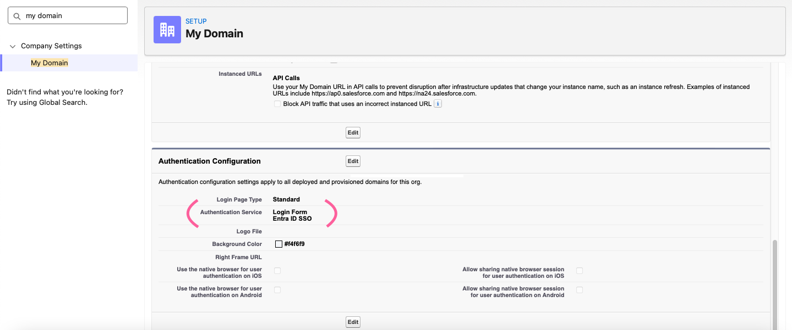

Salesforce My Domain Authentication Configuration confirms Authentication Service is set to: Login Form and Entra ID SSO. This means users hitting the Salesforce login page are redirected to Entra ID for authentication instead of entering a Salesforce password.

---

**Step 5 - SAML SSO test initiated**

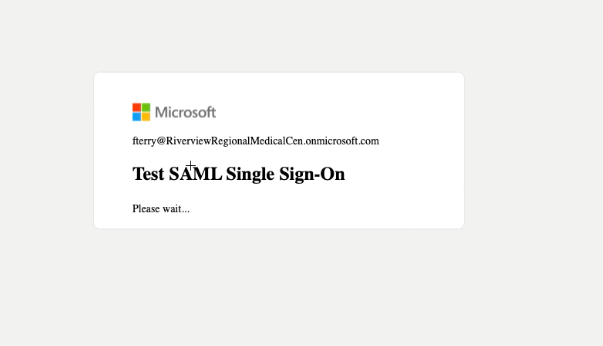

Test SAML Single Sign-On screen showing Microsoft authentication loading for `fterry@RiverviewRegionalMedicalCen.onmicrosoft.com`. The assertion is in flight — Entra ID is processing the authentication request and preparing to send a signed SAML assertion to Salesforce.

---

**Step 6 - Federated login confirmed: Fabella Terry authenticated via Entra ID**

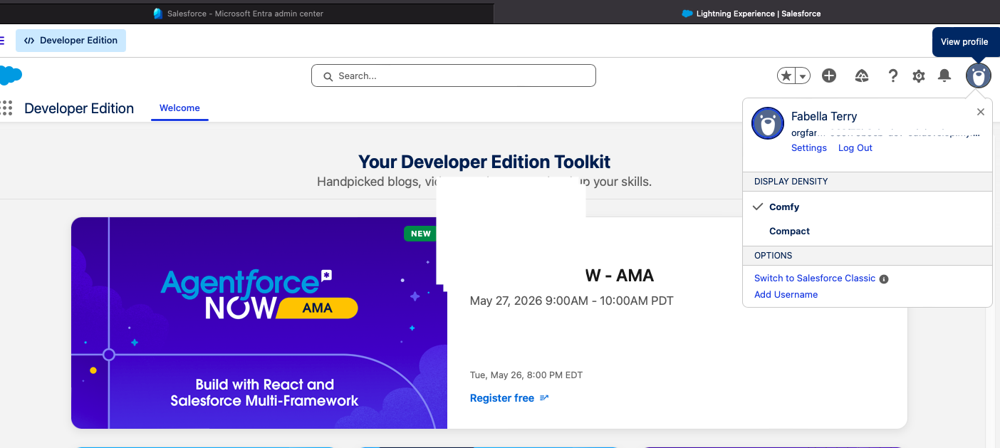

Salesforce Developer Edition home page showing Fabella Terry logged in successfully. No Salesforce password was used. The session was established entirely through the SAML assertion issued by Entra ID. End-to-end SAML federation confirmed working.

**NIST Mapping:** IA-2 (Identification and Authentication), IA-5 (Authenticator Management), SC-8 (Transmission Confidentiality)

---

**Step 7 - Salesforce enterprise app: users assigned in Entra**

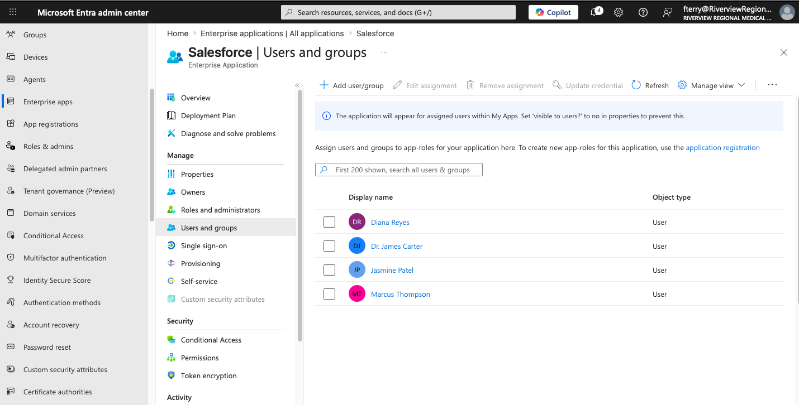

Salesforce enterprise app Users and groups in Entra confirms 4 users assigned: Diana Reyes, Dr. James Carter, Jasmine Patel, Marcus Thompson. Only assigned users can SSO into Salesforce — this is access control enforced at the IdP layer before the assertion is even issued.

**NIST Mapping:** AC-3 (Access Enforcement), AC-6 (Least Privilege)

---

## Part B: OAuth 2.0 / OIDC via Microsoft Graph

Registered an app in Entra ID manually, granted delegated permissions progressively, and used Graph Explorer to execute live API queries authenticated with an OAuth 2.0 / OIDC access token. The GET /users query was run twice — first without User.Read.All (403 Forbidden) and again after granting and consenting the permission (200 OK). This demonstrates the real-world impact of permission scoping.

**App registration:** RVR-OAuth-OIDC-Lab
**Delegated permissions granted:** email, openid, profile, User.Read, User.Read.All
**Graph Explorer queries executed:** GET /me, GET /me/memberOf, GET /users

---

**Step 1 - App registration created: RVR-OAuth-OIDC-Lab**

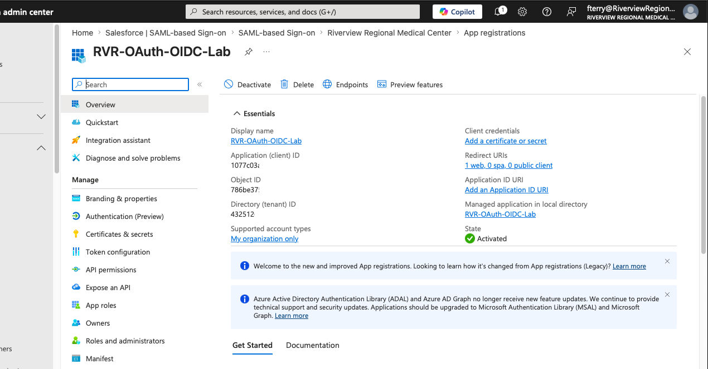

App registration RVR-OAuth-OIDC-Lab confirmed in Entra ID portal showing Application (client) ID: 1077c03a..., Object ID: 786be37..., Directory (tenant) ID: 432512..., State: Activated, Supported account types: My organization only. These values are what any application uses to request tokens from Entra.

**NIST Mapping:** AC-2 (Account Management), IA-4 (Identifier Management)

---

**Step 2 - Initial permissions configured: email, openid, profile, User.Read**

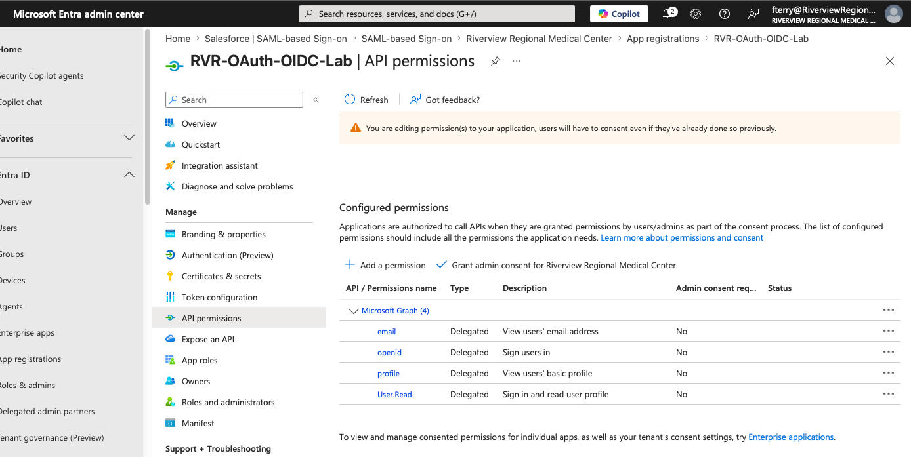

API permissions panel showing the first 4 delegated permissions added: email, openid, profile, User.Read. All delegated type. Admin consent not yet granted at this stage — User.Read.All not yet added. This is the baseline permission set for an OIDC-authenticated application.

---

**Step 3 - Client secret created: RVR-OAuth-Lab-Secret**

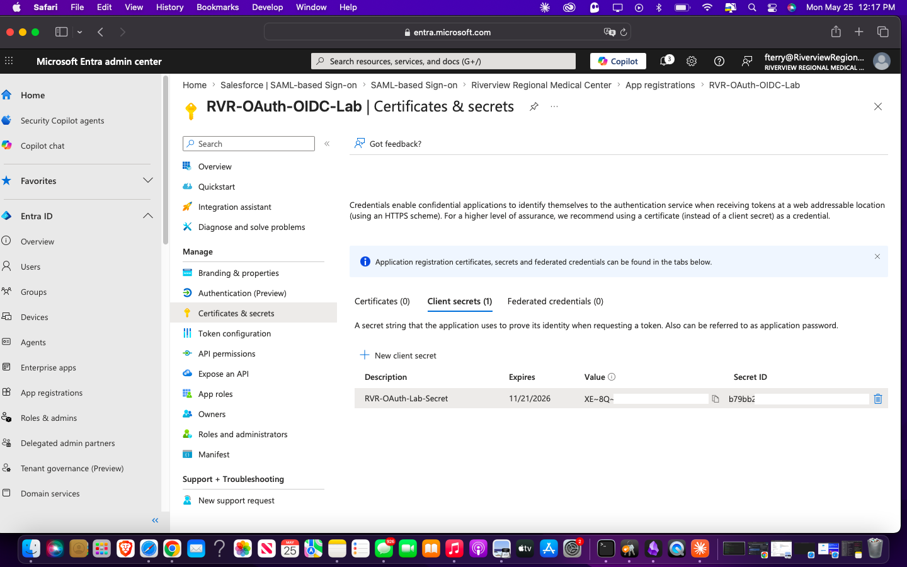

Certificates and secrets panel showing client secret RVR-OAuth-Lab-Secret created with expiry 11/21/2026. The secret value is partially visible (XE-8Q~...) immediately after creation — this is the only time it is visible. After navigating away it is masked permanently. Secret expiry date is the NHI governance control that requires tracking.

---

**Step 4 - User.Read.All added and admin consent granted for all 5 permissions**

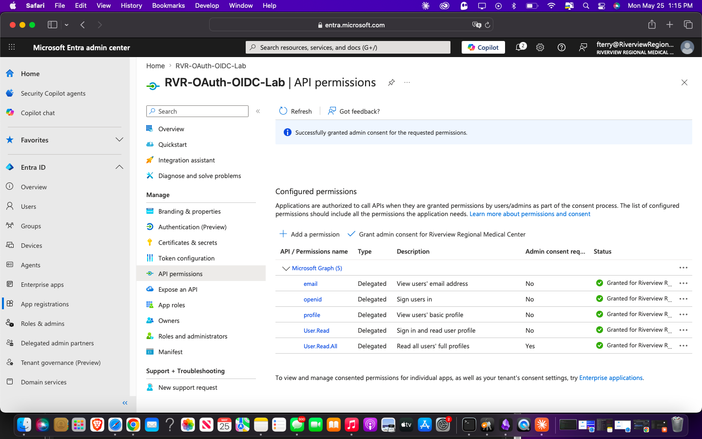

API permissions panel shows all 5 delegated permissions confirmed with admin consent granted for Riverview Regional Medical Center: email, openid, profile, User.Read (all No for admin consent required), User.Read.All (Yes — requires admin consent). Banner confirms "Successfully granted admin consent for the requested permissions."

**NIST Mapping:** AC-6 (Least Privilege), AC-3 (Access Enforcement)

---

**Step 5 - GET /me: Fabella Terry identity confirmed (Query 1)**

Graph Explorer GET /me — OK 200 — 369ms. Response shows Fabella Terry's identity object: displayName, givenName, surname, userPrincipalName (`fterry@RiverviewRegionalMedicalCen.onmicrosoft.com`), id. This is the OIDC identity claim — the app now knows who the signed-in user is without storing credentials.

---

**Step 6 - GET /me/memberOf: group memberships returned (Query 2)**

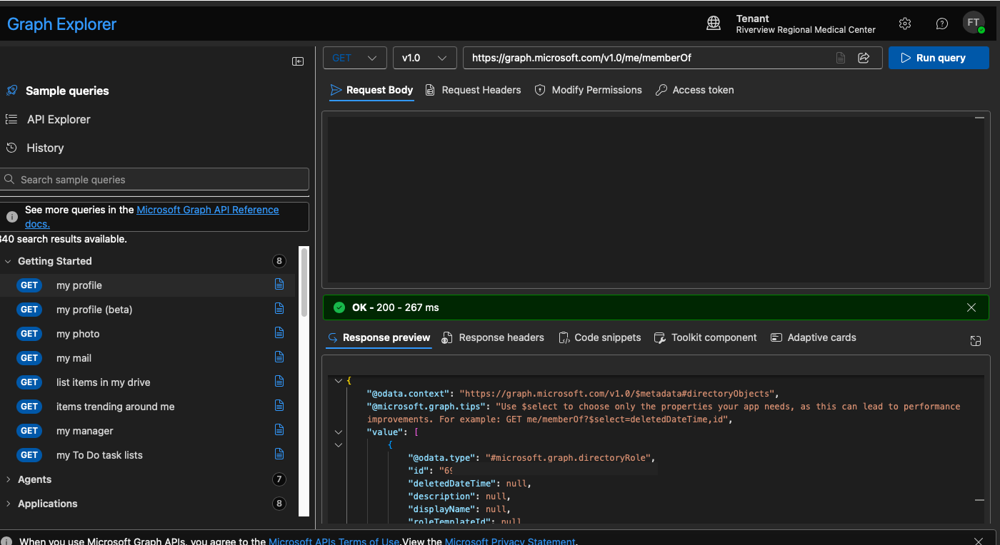

Graph Explorer GET /me/memberOf — OK 200 — 267ms. Response shows directory role objects the signed-in user belongs to, including odata.type: `#microsoft.graph.directoryRole`. This query is how applications make authorization decisions after OIDC authentication — confirm identity via /me, then check group or role membership via /me/memberOf.

---

**Step 7 - GET /users: 403 Forbidden before User.Read.All consent (Query 3 - first attempt)**

Graph Explorer GET /users — Forbidden 403 — 247ms. Error: "Authorization_RequestDenied — Insufficient privileges to complete the operation." This is the expected and correct behavior before User.Read.All is consented. The permission boundary is enforced at the token layer — the app cannot read other users without explicit admin consent for that scope.

---

**Step 8 - GET /users: 200 OK after User.Read.All consent (Query 3 - success)**

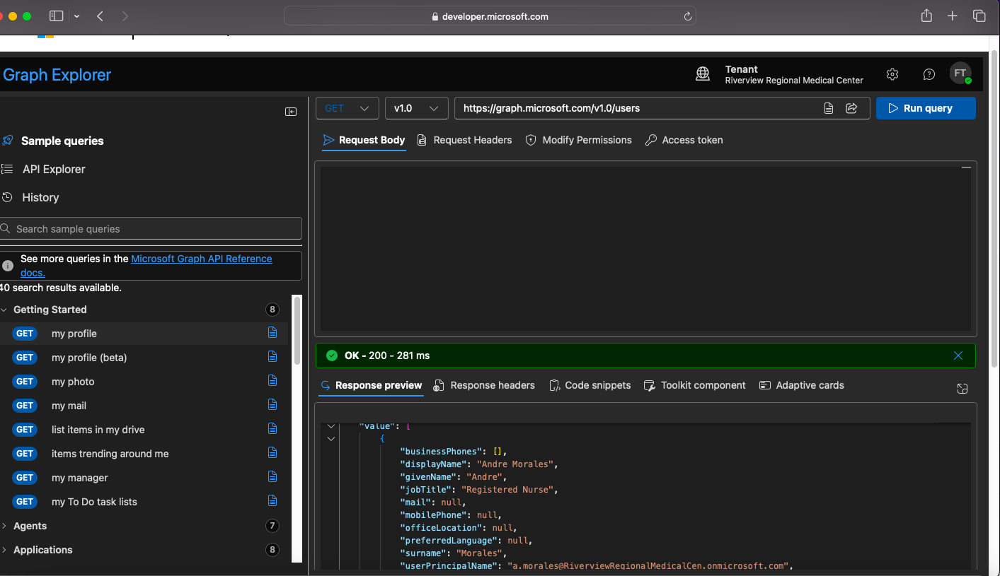

Graph Explorer GET /users — OK 200 — 281ms. Response shows tenant users: Andre Morales (Registered Nurse), with all user object fields returned. This confirms User.Read.All consent is working and the token now carries the scope needed to read all users in the tenant.

**NIST Mapping:** IA-8 (Identification and Authentication), SC-8 (Transmission Confidentiality), AC-4 (Information Flow Enforcement)

---

## Part C: PowerShell App Registration Automation

After completing the manual app registration in Part B, the full workflow was automated using a PowerShell script via Microsoft Graph SDK. The script connects to Graph, creates the app registration, adds all required permissions programmatically, and confirms the result. Both apps are visible in the Entra portal — proving the script produces an identical object to the manual workflow.

---

**Step 1 - Script executed: RVR-OAuth-OIDC-Lab-Auto created, permissions added**

PowerShell terminal shows the full automation run: Connect-MgGraph authenticated via delegated access, New-MgApplication created RVR-OAuth-OIDC-Lab-Auto, Client ID: 0f9b0af5..., Object ID: cd7b5191..., 4 permission GUIDs added via Update-MgApplication, output confirms "Permissions added successfully." The script is reproducible — run it again and it creates a new identical registration.

---

**Step 2 - Both apps confirmed live in Entra App Registrations**

App registrations list shows 9 total applications including RVR-OAuth-OIDC-Lab (created 5/25/2026, Client ID: 1077c03a...) and RVR-OAuth-OIDC-Lab-Auto (created 5/25/2026, Client ID: 0f9b0af5...) both with green "Current" client secret status. Proves the PowerShell script produces an app registration identical in structure to the manual portal workflow.

**NIST Mapping:** AC-2 (Account Management), CM-2 (Baseline Configuration), CM-7 (Least Functionality)

---

## Part D: JWT Claims Analysis

The access token issued by Entra ID to RVR-OAuth-OIDC-Lab was decoded on jwt.ms and each claim mapped to its governance significance.

---

**Step 1 - Token decoded: claims table on jwt.ms**

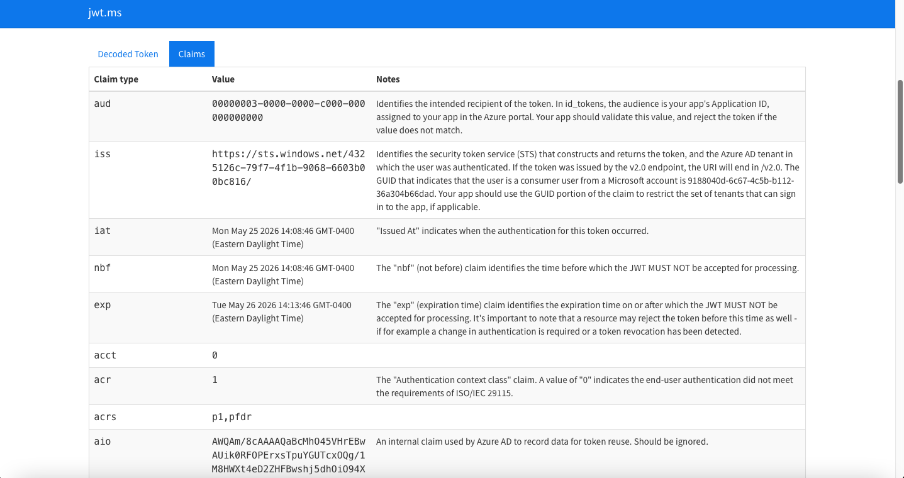

jwt.ms Claims tab shows the decoded token payload for a session issued Mon May 25 2026 14:08:46 GMT-0400. Claims visible: aud (00000003-0000-0000-c000-000000000000 — Microsoft Graph), iss (https://sts.windows.net/432512c6-79f7-4f1b-9068-6603b00bc816/), iat, nbf (both 14:08:46), exp (Tue May 26 2026 14:13:46 — 24-hour window), acct: 0, acr: 1, acrs: p1,pfdr.

---

**JWT Claims Governance Table**

| Claim | Value | Governance Significance |
|---|---|---|
| `aud` | 00000003-0000-0000-c000-000000000000 | Scoped to Microsoft Graph only. Token is invalid for any other resource. |
| `iss` | https://sts.windows.net/432512c6... | Confirms token was issued by this specific Entra tenant. Cross-tenant token replay blocked. |
| `iat` | May 25 2026 14:08:46 | Token issuance time. Baseline for detecting token replay attacks. |
| `nbf` | May 25 2026 14:08:46 | Not valid before this time. Prevents premature token use. |
| `exp` | May 26 2026 14:13:46 | 24-hour expiry window. Short-lived tokens limit blast radius of a stolen token. |
| `acct` | 0 | Account type: 0 = work/school account. Confirms user is a tenant member, not a guest. |
| `acr` | 1 | Authentication context class reference: 1 = basic auth met ISO/IEC 29115. Would be higher if step-up MFA was required. |
| `acrs` | p1,pfdr | Authentication context reference classes. Maps to Conditional Access compliance state. |

**Key finding:** The `exp` claim shows a 24-hour token window. In a production environment this would be tightened via Conditional Access token lifetime policies to reduce the window a stolen token remains valid. Short expiry combined with CA re-evaluation is the primary OAuth 2.0 security control for stolen token scenarios.

**NIST Mapping:** IA-5 (Authenticator Management), SC-8 (Transmission Confidentiality), SC-28 (Protection of Information at Rest), SI-4 (System Monitoring)

---

## Protocol Comparison

| Protocol | Primary Function | Token / Format | Ideal Use Case | Implemented In |
|---|---|---|---|---|
| SAML 2.0 | Federated SSO: authentication assertion between IdP and SP | XML Assertion (signed) | Legacy enterprise SaaS: Salesforce, ServiceNow, on-prem apps | Part A: Salesforce SSO |
| OAuth 2.0 | Delegated authorization: grants scoped access to resources without sharing credentials | JWT Access Token | API access, mobile apps, modern SaaS integrations, CI/CD pipelines | Part B/C: Graph API |
| OIDC | Identity layer on top of OAuth 2.0: authenticates the user AND authorizes resource access | JWT ID Token + Access Token | Modern SSO for any app needing to know who the user is | Part B: Graph Explorer /me |

**Architectural note:** SAML was used for Salesforce because Salesforce's SSO implementation is SAML-native. OAuth 2.0 and OIDC were used for Microsoft Graph because Graph is a modern API that expects token-based authorization. In a mature hybrid enterprise environment, both protocols coexist: SAML for legacy app federation, OIDC/OAuth for cloud-native API integrations.

---

## Key Findings

| Finding | Detail |
|---|---|
| 403 before consent is correct behavior | GET /users returned Forbidden before User.Read.All was granted. The permission boundary enforced at the token layer is working as designed. |
| Delegated vs application permissions | All permissions granted as delegated — the app acts on behalf of the signed-in user, not as itself. Least privilege applied at the permission type layer. |
| Token audience scoping | JWT aud claim confirms the token is only valid for Microsoft Graph. Cannot be replayed against another resource. |
| Token expiry window | 24-hour exp in this lab. Production environments should tighten via CA token lifetime policies to reduce stolen token blast radius. |
| Client secret expiry tracking | Both app registrations have client secrets with expiry dates (11/21/2026). Unmanaged secret rotation is an NHI governance gap requiring alerting and automated rotation controls. |
| Script parity with portal | RVR-OAuth-OIDC-Lab-Auto created by PowerShell is identical in structure to the manually created RVR-OAuth-OIDC-Lab. Automation is viable for scaling app registration onboarding. |
| Access controlled at IdP layer | Only the 4 users assigned to the Salesforce enterprise app in Entra can SSO. Users not assigned receive no assertion — access control enforced before Salesforce is involved. |

---

## NHI Governance Note

Both app registrations created in this lab have client secrets with expiry dates. In a production environment, unrotated or expired secrets break integrations and create ungoverned credentials. The correct controls are:

1. Centralized secret inventory with expiry tracking
2. Automated rotation before expiry via Key Vault or equivalent
3. Alert on secrets approaching expiry window
4. Named human owner accountable for each app registration credential lifecycle

---

## NIST SP 800-53 Control Mapping

| Control | Description | Implementation |
|---|---|---|
| AC-2 | Account Management | App registrations created with named ownership and documented permissions |
| AC-3 | Access Enforcement | Delegated permissions scope what Graph queries the app can execute |
| AC-4 | Information Flow Enforcement | Token audience (aud) restricts token use to the intended resource only |
| AC-6 | Least Privilege | Delegated permissions only; no application-level permissions granted |
| AC-17 | Remote Access | SAML SSO enforces Entra ID authentication before granting Salesforce access |
| IA-2 | Identification and Authentication | SAML and OIDC both authenticate the user via Entra ID before granting access |
| IA-4 | Identifier Management | App registration Application ID and Object ID are non-human identity identifiers |
| IA-5 | Authenticator Management | Client secrets have expiry dates; rotation required before expiry |
| IA-8 | Identification and Authentication - Non-Organizational Users | Salesforce and Graph users authenticated via federated identity, not local credentials |
| SC-8 | Transmission Confidentiality | SAML assertions and OAuth tokens transmitted over TLS |
| SC-28 | Protection of Information at Rest | JWT claims contain identity data subject to protection at rest |
| SI-4 | System Monitoring | Token claims including iat, exp, and acr provide audit evidence for session monitoring |
| CM-2 | Baseline Configuration | PowerShell script documents and replicates the app registration configuration as code |
| CM-7 | Least Functionality | App registrations scoped to minimum required permissions only |

---

## Skills Demonstrated

`SAML 2.0` `OAuth 2.0` `OpenID Connect (OIDC)` `Federation` `SSO` `Salesforce SSO` `Microsoft Graph` `App Registration` `Delegated Permissions` `JWT` `Token Analysis` `jwt.ms` `Claims Mapping` `PowerShell Automation` `Microsoft Graph SDK` `Client Secret Management` `NHI Governance` `Entra ID` `Identity Provider Configuration` `Service Provider Configuration` `NIST 800-53` `AC-6 Least Privilege` `IA-5 Authenticator Management` `SC-8 Transmission Confidentiality`
